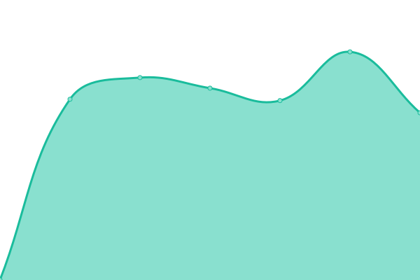

# [📈 Live Status](https://demo.upptime.js.org): <!--live status--> **🟩 All systems operational**

This repository contains the open-source uptime monitor and status page for [Upptime](https://upptime.js.org), powered by [Upptime](https://github.com/upptime/upptime).

With [Upptime](https://upptime.js.org), you can get your own unlimited and free uptime monitor and status page, powered entirely by a GitHub repository. We use [Issues](https://github.com/upptime/upptime/issues) as incident reports, [Actions](https://github.com/upptime/upptime/actions) as uptime monitors, and [Pages](https://demo.upptime.js.org) for the status page.

<!--start: status pages-->
<!-- This summary is generated by Upptime (https://github.com/upptime/upptime) -->
<!-- Do not edit this manually, your changes will be overwritten -->
<!-- prettier-ignore -->
| URL | Status | History | Response Time | Uptime |
| --- | ------ | ------- | ------------- | ------ |
|  [Public Site](https://coastguard.com.au) | 🟩 Up | [public-site.yml](https://github.com/avcga/uptime/commits/master/history/public-site.yml) | 

 1711ms
     
 | 

<a href="https://avcga.github.io/uptime/history/public-site">100.00%</a>
    

|  [Members Portal](https://portal.coastguard.com.au) | 🟩 Up | [members-portal.yml](https://github.com/avcga/uptime/commits/master/history/members-portal.yml) | 

 1436ms
     
 | 

<a href="https://avcga.github.io/uptime/history/members-portal">100.00%</a>
    

|  [Helpdesk](https://jira.coastguard.com.au) | 🟩 Up | [helpdesk.yml](https://github.com/avcga/uptime/commits/master/history/helpdesk.yml) | 

 1123ms
     
 | 

<a href="https://avcga.github.io/uptime/history/helpdesk">100.00%</a>
    

|  [SafeTrx](https://safetrx.coastguard.com.au) | 🟩 Up | [safe-trx.yml](https://github.com/avcga/uptime/commits/master/history/safe-trx.yml) | 

 824ms
     
 | 

<a href="https://avcga.github.io/uptime/history/safe-trx">100.00%</a>
    

<!--end: status pages-->

[**Visit our status website →**](https://demo.upptime.js.org)

## 📄 License

- Powered by: [Upptime](https://github.com/upptime/upptime)
- Code: [MIT](./LICENSE) © [Upptime](https://upptime.js.org)
- Data in the `./history` directory: [Open Database License](https://opendatacommons.org/licenses/odbl/1-0/)
