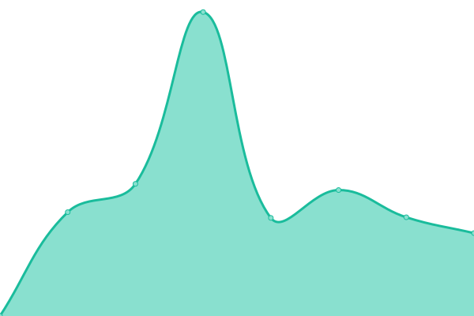
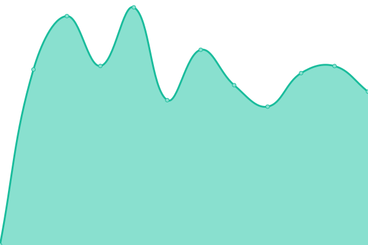

# [📈 Live Status](https://demo.upptime.js.org): <!--live status--> **🟧 Partial outage**

This repository contains the open-source uptime monitor and status page for [Australian Volunteer Coast Guard IT Systems](https://coastguard.com.au), powered by [Upptime](https://github.com/upptime/upptime).

<!--start: status pages-->
<!-- This summary is generated by Upptime (https://github.com/upptime/upptime) -->
<!-- Do not edit this manually, your changes will be overwritten -->
<!-- prettier-ignore -->
| URL | Status | History | Response Time | Uptime |
| --- | ------ | ------- | ------------- | ------ |
|  [Public Website](https://coastguard.com.au) | 🟩 Up | [public-website.yml](https://github.com/avcga/uptime/commits/HEAD/history/public-website.yml) | 

 2208ms
     
 | 

<a href="https://status.coastguard.com.au/history/public-website">100.00%</a>
    

|  [Members Portal](https://portal.coastguard.com.au) | 🟥 Down | [members-portal.yml](https://github.com/avcga/uptime/commits/HEAD/history/members-portal.yml) | 

 665ms
     
 | 

<a href="https://status.coastguard.com.au/history/members-portal">0.00%</a>
    

|  [SafeTrx](https://safetrx.coastguard.com.au) | 🟩 Up | [safe-trx.yml](https://github.com/avcga/uptime/commits/HEAD/history/safe-trx.yml) | 

 858ms
     
 | 

<a href="https://status.coastguard.com.au/history/safe-trx">100.00%</a>
    

|  [Database (New)](https://database.coastguard.com.au) | 🟩 Up | [database-new.yml](https://github.com/avcga/uptime/commits/HEAD/history/database-new.yml) | 

 900ms
     
 | 

<a href="https://status.coastguard.com.au/history/database-new">100.00%</a>
    

|  [Database (Old QSC)](https://database-qsc.coastguard.com.au) | 🟩 Up | [database-old-qsc.yml](https://github.com/avcga/uptime/commits/HEAD/history/database-old-qsc.yml) | 

 858ms
     
 | 

<a href="https://status.coastguard.com.au/history/database-old-qsc">100.00%</a>
    

|  [TripWatch](https://tripwatch.coastguard.com.au) | 🟩 Up | [trip-watch.yml](https://github.com/avcga/uptime/commits/HEAD/history/trip-watch.yml) | 

 1699ms
     
 | 

<a href="https://status.coastguard.com.au/history/trip-watch">100.00%</a>
    

<!--end: status pages-->

[**Visit our status website →**](https://status.coastguard.com.au)

## 📄 License

- Powered by: [Upptime](https://github.com/upptime/upptime)
- Code: [MIT](./LICENSE) © [Upptime](https://upptime.js.org)
- Data in the `./history` directory: [Open Database License](https://opendatacommons.org/licenses/odbl/1-0/)
